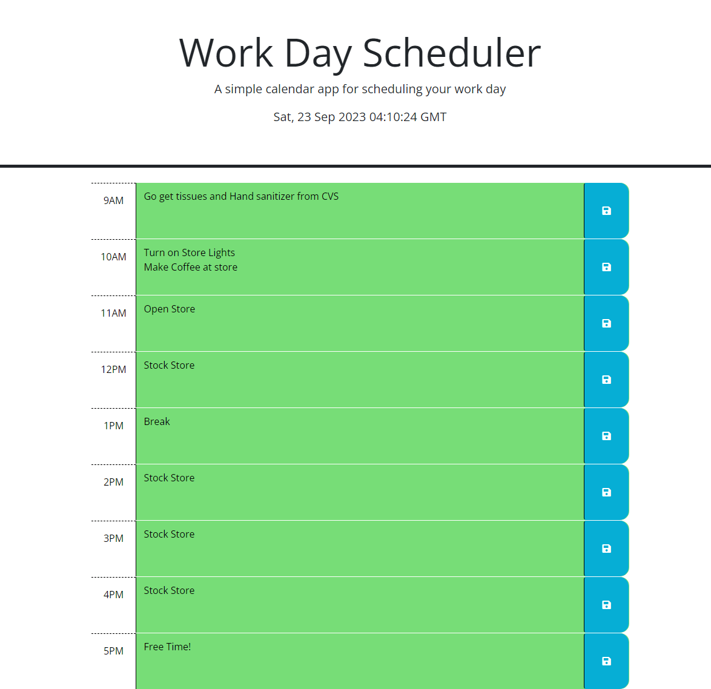

# Day Scheduler

## Description
This is a web app that acts as a day scheduler. I created this website using a base given to me by my bootcamp in order for me to better understand jquery and day.js.

When creating this website, I learned what .each() functions were. I also finally learned how to understand localStorage, which has been something that I have struggled immensely with. 

## Useability / Screenshot
The date is listed in the header of the website, and underneath are nine boxes, the same amount of boxes in a typical work day. To add something to one of these boxes, simply click on the text area. When you hit the blue save button on the side, it will be saved to local storage. 

## Credits
The HTML and CSS for this application was provided by edX. 

## Link